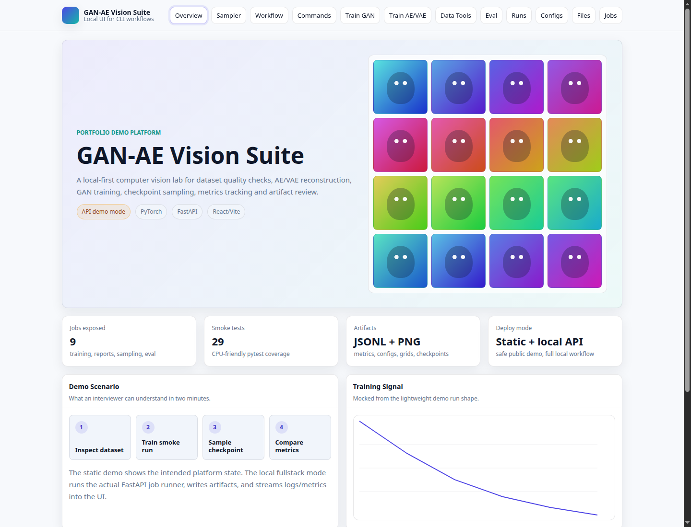
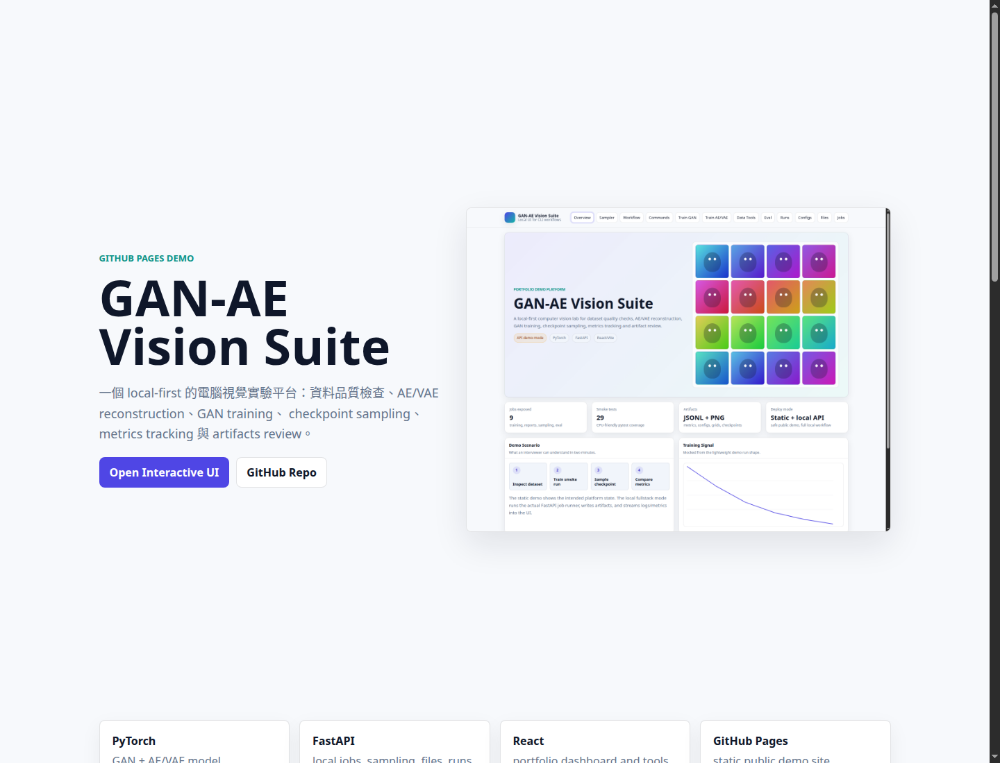
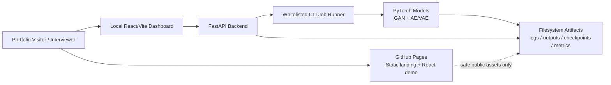
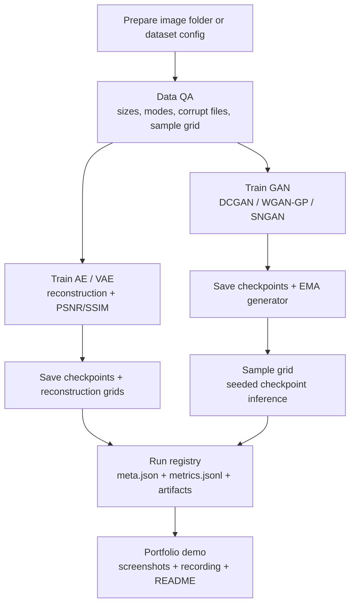
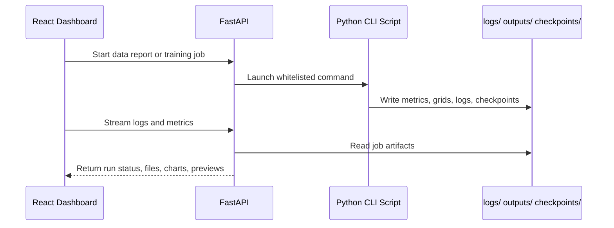

# GAN-AE Vision Suite

Portfolio-ready computer vision lab for dataset inspection, AE/VAE reconstruction, GAN training, checkpoint sampling, metrics tracking, artifact review, and interview-friendly demo presentation.

The project is intentionally local-first: the public demo runs as a static GitHub Pages portfolio site, while the full ML workflow runs through a local FastAPI backend so training jobs and filesystem access are not exposed on the open internet.

## Live Demo

| Surface | URL | Purpose |
| --- | --- | --- |
| Portfolio landing page | <https://justin21523.github.io/GAN-AE-vision-suite/> | Fast project overview, screenshots, demo video, architecture summary |
| Interactive UI preview | <https://justin21523.github.io/GAN-AE-vision-suite/app/> | Static React/Vite demo shell for walkthroughs and screenshots |
| Source code | <https://github.com/Justin21523/GAN-AE-vision-suite> | Full FastAPI, PyTorch, React, scripts, tests, and deployment notes |

## Demo Evidence



| Landing Page | GAN Samples | AE Reconstruction |
| --- | --- | --- |
|  |  |  |

Demo recording:

<video src="docs/assets/demo-walkthrough.mp4" controls width="100%"></video>

If the video does not render in your Markdown viewer, open [`docs/assets/demo-walkthrough.mp4`](docs/assets/demo-walkthrough.mp4).

## What This Project Shows

| Capability | Implementation | Interview Signal |
| --- | --- | --- |
| Config-driven ML experiments | YAML dataset/model/training configs under `configs/` | Reproducible research workflow instead of notebook-only experiments |
| GAN training and sampling | DCGAN/WGAN-GP/SNGAN-style models, EMA-aware sampling, checkpoint compatibility helpers | PyTorch model implementation and operational model loading |
| AE/VAE reconstruction | Convolutional AE, ConvAE, VAE variants, reconstruction grids, PSNR/SSIM hooks | Representation learning and image-quality evaluation |
| Local orchestration API | FastAPI endpoints, job runner, config validation, run registry, artifact browser | Backend design around a real ML workflow |
| React control console | Overview, workflow, training, sampler, data tools, eval, runs, configs, files | UI/UX around technical workflows, not only static pages |
| Public demo platform | GitHub Pages, screenshots, demo video, sample data, README diagrams | Portfolio packaging and deployment discipline |

## System Architecture



The public site intentionally does not expose the backend. Anything that can execute jobs, browse local files, or write artifacts is designed for local use or authenticated deployment only.

## ML Workflow



## Data And Artifact Flow



## Feature Map

| Area | Completed Demo Capability | Key Files |
| --- | --- | --- |
| Public demo | Static landing page, screenshots, demo video, embedded React build | `docs/`, `portfolio-web/`, `scripts/build_pages.sh` |
| API | App health, checkpoint sampling, job execution, config validation, run and file browsing | `src/api/main.py`, `src/service/`, `src/utils/checkpoint.py` |
| Models | GAN and AE/VAE modules with checkpoint-friendly factory/loading paths | `src/models/gan/`, `src/models/ae/` |
| Training | GAN and AE training scripts with config-first options | `src/scripts/train_gan.py`, `src/scripts/train_ae.py`, `configs/` |
| Evaluation | Image-quality metrics and GAN pipeline helpers | `src/metrics/`, `src/scripts/eval_gan_pipeline.py` |
| Frontend | Overview, workflow, sampler, jobs, metrics, configs, files, runs | `gan-ui/src/` |
| Demo data | Safe sample metrics and reports for portfolio walkthroughs | `demo/` |
| Tests | CPU-friendly smoke coverage | `tests/` |

## Tech Stack

| Layer | Tools |
| --- | --- |
| ML | Python, PyTorch, NumPy, Pillow, YAML configs |
| Metrics | PSNR, SSIM, FID/KID hooks through torchmetrics-compatible utilities |
| API | FastAPI, Pydantic, Uvicorn, Server-Sent Events style log/metric streaming |
| UI | React, Vite, plain CSS |
| Artifacts | Filesystem-based `logs/`, `outputs/`, `.ai_cache/`; no database required |
| Quality | pytest, ESLint, Vite build, npm audit |
| Deployment | GitHub Pages for public static demo; local/protected FastAPI for full ML workflow |

## Project Structure

```text
src/                 Python package: API, data, models, metrics, scripts, services
configs/             Dataset/model/GAN YAML configs and split lists
gan-ui/              React + Vite dashboard
demo/                Safe-to-commit demo scenario and sample JSON artifacts
docs/                GitHub Pages output, screenshots, demo video, built UI
portfolio-web/       Static portfolio landing source
scripts/             Local API/fullstack and Pages build helpers
tests/               CPU-friendly pytest suite
```

## Quick Start

Install dependencies:

```bash
python -m pip install -r requirements.txt
cd gan-ui && npm ci
```

Run the full local demo:

```bash
scripts/dev_fullstack.sh
```

Open:

- UI: `http://127.0.0.1:5173`
- API: `http://127.0.0.1:8000`

## Useful Commands

```bash
# Tests
pytest -q

# Frontend checks
cd gan-ui
npm run lint
npm run build

# Rebuild GitHub Pages assets, screenshots, and demo recording
scripts/build_pages.sh

# Create deterministic screenshot artifacts only
python -m src.scripts.make_demo_assets --out ./outputs/demo

# Create a tiny demo image folder for smoke runs
python -m src.scripts.prepare_data --create-demo-imagefolder ./data/demo_images --num-images 32 --img-size 64

# Data report
python -m src.scripts.data_report --config configs/dataset_celeba.yaml --out ./outputs/data_report

# GAN training example
python -m src.scripts.train_gan --config configs/gan/wgangp_celeba128.yaml

# API only
scripts/serve_api.sh
```

## Interview Walkthrough Script

| Step | What To Show | Why It Matters |
| --- | --- | --- |
| 1 | Open the GitHub Pages landing page | Shows the project is packaged as a public portfolio artifact |
| 2 | Play the demo recording | Gives reviewers a fast visual tour without local setup |
| 3 | Open the React `/app/` demo | Shows the intended ML workflow and UI structure |
| 4 | Explain the architecture diagram | Separates public static demo from local backend execution |
| 5 | Run local `scripts/dev_fullstack.sh` | Demonstrates the full FastAPI + React workflow |
| 6 | Start a small data report or training smoke job | Shows job orchestration, logs, metrics, and artifacts |
| 7 | Inspect generated grids and run metadata | Connects ML output to reproducible evidence |
| 8 | Run `pytest -q` and frontend build | Shows the project is executable and checked |

## Deployment Strategy

| Target | Recommended Use | Notes |
| --- | --- | --- |
| GitHub Pages | Public portfolio, screenshots, video, static React demo | Current deployed path: `/GAN-AE-vision-suite/` |
| Vercel / Netlify | Alternative static frontend hosting | Works well for the public demo surface |
| Render / Railway | Optional protected API hosting | Only use with authentication and a restricted job queue |
| Local machine | Full ML workflow | Best place for training jobs, checkpoint sampling, and filesystem artifacts |

See [DEPLOYMENT.md](DEPLOYMENT.md) for deployment details and safety notes.

## Current Verification

The latest portfolio hardening pass verified:

```bash
pytest -q
cd gan-ui && npm run lint
cd gan-ui && npm run build
cd gan-ui && npm audit --audit-level=low
```

Expected result: tests pass, frontend builds, and npm audit reports no vulnerabilities. PyTorch may print non-blocking deprecation warnings from internal DataLoader options.

## Current Limitations

- The public GitHub Pages demo is static by design; it does not run training jobs.
- Full backend deployment should be protected because the API can launch local scripts and inspect artifacts.
- Demo screenshots use deterministic sample assets; long-running real training results can be added as future evidence.
- E2E tests are not yet automated with Playwright; current coverage is pytest plus frontend lint/build.
